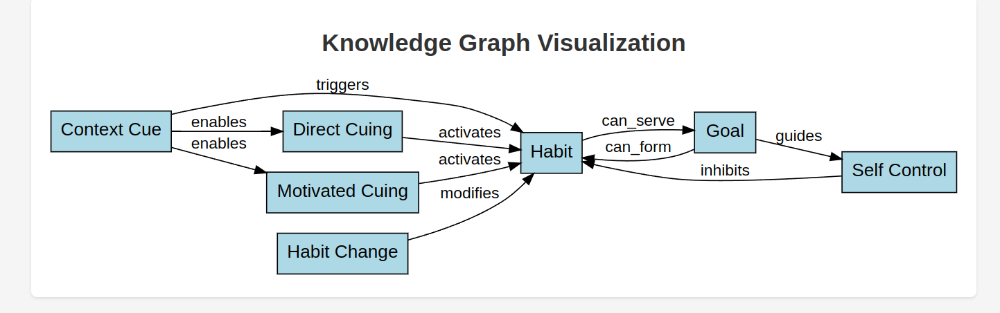

# Course Creation Tools

A collection of Python tools for creating interactive course content, including knowledge graph visualization and animated SVG generation.

## Features

### 1. Knowledge Graph Visualizer

Create interactive visualizations of knowledge graphs from YAML descriptions.

#### Installation

```bash
python -m venv venv
source venv/bin/activate
pip install -r requirements.txt
```

#### Usage

1. Create a YAML file describing your knowledge graph. 
You can do that manually, or you can ask an AI agent to do it for you.
The graph [habits-knowledge-graph.yaml](data/yaml/habits-knowledge-graph.yaml) was created by Claude
from the paper 'A new look at Habits and the Habit Goal' (available thorug ReseachGate) and the [schema](knowledge_graph_schema.json) using the following prompt:

```plain text
I'd like you to summarise the uploaded pdf file and convert it to a yaml file using the knowledge graph schema that I uploaded.
```

Conversion produced this image:



If you display the generated html in a browser, you should see more detail when you hover over one of the concept boxes.

Here's a simpler example:

```yaml
entities:
  - id: "python"
    name: "Python"
    description: "A high-level programming language"
  - id: "java"
    name: "Java"
    description: "A class-based programming language"

relationships:
  - source: "python"
    target: "java"
    name: "is more dynamic than"
```

2. Generate the visualization:

```bash
./knowledge_graph_visualizer.py your_graph.yaml
```

This will create:
- `output/knowledge_graph.svg`: The SVG visualization
- `output/knowledge_graph_inline.html`: A self-contained HTML file with embedded SVG (perfect for blog posts)


#### Features
- Interactive graph visualization using Graphviz
- Hover text for detailed descriptions
- Multiple relationships between entities
- Both standalone SVG and self-contained HTML output
- Responsive design that works well on all devices

### 2. Brain Animation Tool

Create animated SVG visualizations and convert them to MP4 videos.

#### Requirements
- Python 3.x
- Selenium WebDriver
- Chrome/Chromium browser
- ffmpeg

#### Features
- Captures SVG animations using Selenium
- Converts animation frames to MP4 video
- Configurable frame rate and duration
- Automated cleanup of temporary files

#### Usage

1. Start the animation server:
```bash
cd brain_animation
python manage.py runserver
```

2. Capture the animation:
```bash
python capture_animation.py
```

This will:
- Capture 180 frames at 30fps (6 seconds)
- Convert the frames to an MP4 video
- Clean up temporary files
- Output `brain_animation.mp4`

## Development

### Running Tests

```bash
pytest test_knowledge_graph.py -v
```

The test suite covers:
- Knowledge graph generation
- HTML output creation
- Error handling for invalid YAML
- Relationship validation

## License

This project is licensed under the MIT License - see the LICENSE file for details.

## Contributing

1. Fork the repository
2. Create your feature branch
3. Write tests for new features
4. Submit a pull request

## Acknowledgments

- Built with [Graphviz](https://graphviz.org/)
- Animation capture using [Selenium](https://www.selenium.dev/)
- Video conversion using [ffmpeg](https://ffmpeg.org/)
